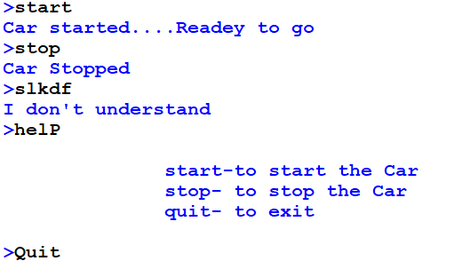

# 🏎️ Car Game in Python

A beginner-friendly Python game where a car is controlled with keyboard input. Great for learning basic conditionals, loops, and key events.

---

## 🎮 Features

- Control car with keys (e.g., up/down/left/right)
- Console or GUI based (customize based on your version)
- Simple and fun logic for beginners

---

## 🛠 Tech

- Language: Python 🐍

---

## 📸 Screenshot

| Game Preview |
|--------------|
|  |


## 🚀 Run the game

```bash
python car_game.py


